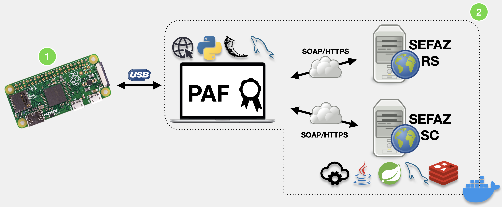

[](https://www.gnu.org/licenses/gpl-3.0)

> # Aviso de isenção de responsabilidade
>
>A presente prova de conceito (POC) é um artefato fruto do Contrato de Encomenda Tecnológica nº 001/2020, firmado entre a Secretaria de Estado da Fazenda de Santa Catarina e o Instituto Federal de Santa Catarina - IFSC.
>
>O objetivo desta prova de conceito é restrito aos objetivos contratados entre a SEF e o IFSC, compatível apenas com a versão 2.0.1 da especificação técnica de requisitos do DAF. Este artefato não tem como objetivo implementar completamente todos os processos de negócio previstos na especificação, visto que seu intuito foi demonstrar a viabilidade de implementação, tanto do DAF quanto da integração entre o PAF, DAF e a SEF-SC, utilizando tecnologias amplamente adotadas pelo mercado de desenvolvimento de software.
>
>Não cabe à SEF ou ao IFSC prestar suporte sobre os componentes, códigos ou excertos de código disponíveis nesta POC, sendo a presente versão considerada final, sem previsão de alterações, correção de bugs ou melhorias.
>
>A SEF e o IFSC eximem-se de qualquer responsabilidade, direta ou indireta, por perdas ou danos, comprovadamente ou alegadamente, causados pelos artefatos disponibilizados nesta POC. Caso deseje usar os componentes e softwares aqui disponibilizados, você estará fazendo isto exclusivamente por sua conta e risco.

# Composição Docker com PAF, SEF e SEFAZ Autorizadora

**Sumário**

  - [Introdução](#introdução)
  - [Composição Docker com PAF, SEF e SEFAZ Autorizadora](#composição-docker-com-paf-sef-e-sefaz-autorizadora-1)
    - [Casos de uso implementados pelo PAF](#casos-de-uso-implementados-pelo-paf)
    - [Requisitos para usar essa composição Docker](#requisitos-para-usar-essa-composição-docker)
  - [Como executar em um computador hospedeiro (Docker Host) executando o sistema operacional Linux](#como-executar-em-um-computador-hospedeiro-docker-host-executando-o-sistema-operacional-linux)
  - [Como executar em um computador hospedeiro (Docker Host) executando o sistema operacional macOS](#como-executar-em-um-computador-hospedeiro-docker-host-executando-o-sistema-operacional-macos)
    - [Executando o PAF localmente no computador hospedeiro](#executando-o-paf-localmente-no-computador-hospedeiro)
  - [Personalizações opcionais da composição](#personalizações-opcionais-da-composição)
    - [Personalizações para desenvolvedores de PAF](#personalizações-para-desenvolvedores-de-paf)
    - [Personalizações para fabricantes de DAF](#personalizações-para-fabricantes-de-daf)
  - [Limitações conhecidas](#limitações-conhecidas)
    - [Casos de uso não implementados](#casos-de-uso-não-implementados)
    - [Valor do *timeout* da camada ARQ do protocolo de comunicação do DAF](#valor-do-timeout-da-camada-arq-do-protocolo-de-comunicação-do-daf)
  - [Dependências e bibliotecas de terceiros](#dependências-e-bibliotecas-de-terceiros)
## Introdução

Na [Especificação 2.0.1 do Dispositivo Autorizador Fiscal (DAF)](https://www.sef.sc.gov.br/arquivos_portal/servicos/159/DAF_Especificacao_de_Requisitos_2.0.1.pdf.pdf) são apresentados todos os casos de uso e protocolos que devem ser implementados pelo DAF para que o mesmo possa ser comandado pelo Programa Aplicativo Fiscal (PAF), bem como são listados todos os Serviços *Web* (*Web Services*) da Secretaria de Estado da Fazenda (SEF) que poderão ser consumidos pelo PAF para emissão de Nota Fiscal de Consumidor Eletrônica (NFC-e) em Santa Catarina no contexto do uso do Dispositivo Autorizador Fiscal (DAF), o que inclui o registro do DAF a validação de autorizações emitidas pelo mesmo. 

Este repositório apresenta uma implementação de um Programa Aplicativo Fiscal (PAF), os Serviços *Web* da  Secretaria do Estado da Fazenda de Santa Catarina (SEF) e uma implementação da SEFAZ Autorizadora e tem como público alvo desenvolvedores de PAF e fabricantes de DAF.

A implementação do PAF, da SEF e da SEFAZ autorizadora são disponibilizadas dentro de contêineres *Docker* e fazem parte do *kit* de desenvolvimento oferecido aos desenvolvedores de PAF e fabricantes de DAF. Na figura abaixo são apresentadas todas as entidades que fazem parte do *kit* de desenvolvimento.



1. [**DAF-pi**](https://github.com/ifsc-lased/daf-pi)
   - Implementação em Python3 de todos os casos de uso da [Especificação 2.0.1 do Dispositivo Autorizador Fiscal (DAF)](https://www.sef.sc.gov.br/arquivos_portal/servicos/159/DAF_Especificacao_de_Requisitos_2.0.1.pdf.pdf) para ser executada exclusivamente em uma [Raspberry Pi Zero W](https://www.raspberrypi.org/products/raspberry-pi-zero-w/). O DAF-pi só pode ser usado como ferramenta de apoio para desenvolvimento do PAF, uma vez que a Raspberry Pi não atende os requisitos de segurança da especificação do DAF. O código fonte, bem como as instruções para instalar a imagem na Raspberry PI Zero W, estão disponíveis [neste repositório](https://github.com/ifsc-lased/daf-pi).
     - O [**DAF-pi**](https://github.com/ifsc-lased/daf-pi) foi desenvolvido considerando que seria mais fácil para o desenvolvedor de PAF adquirir no mercado uma Raspberry Pi Zero W. Contudo, também foi feita uma prova de conceito de DAF, denominada [DAF-poc](https://github.com/ifsc-lased/daf-poc), em um *hardware* com o microcontrolador MAX 32552 da Maxim. O código fonte desta prova de conceito pode ser obtido [neste repositório](https://github.com/ifsc-lased/daf-poc).
2. Composição com PAF, SEF e SEFAZ Autorizadora (este repositório)
   - **PAF** 
      - O [PAF](paf) do *kit* de desenvolvimento só implementa as rotinas cruciais para interação com o DAF, SEFAZ autorizadora e SEF. Trata-se assim de uma ferramenta de apoio, para desenvolvedores de PAF e fabricantes de DAF, e não efetivamente um PAF que segue a especificação PAF-DAF publicada pela SEF.
   - **SEFAZ Autorizadora** 
      - A SEFAZ Autorizadora no *kit* de desenvolvimento tem como foco somente o caso de uso para autorização de uso de DF-e. A implementação consiste de uma simples rotina de persistência do DF-e autorizado para uso no banco de dados relacional usado pelo PAF. Sendo assim, não consiste de uma implementação real da SEFAZ autorizadora.
   - **Secretaria do Estado da Fazenda de Santa Catarina (SEF)** 
      - A [SEF](sef) no *kit* de desenvolvimento provê implementação para os todos os casos de uso que envolvam diretamente o contribuinte e seu DAF, conforme apresentado na [Especificação 2.0.1 do Dispositivo Autorizador Fiscal (DAF)](https://www.sef.sc.gov.br/arquivos_portal/servicos/159/DAF_Especificacao_de_Requisitos_2.0.1.pdf.pdf), como por exemplo: registro de DAF, remoção de registro, autorização para remoção de autorização retida no DAF, entre outras.

## Composição Docker com PAF, SEF e SEFAZ Autorizadora 

Esta composição Docker ter objetivo ser uma ferramenta de apoio para desenvolvedores de PAF e fabricantes de DAF para que seus produtos possam ser desenvolvidos mesmo enquanto não existe uma implementação oficial dos serviços da SEF ou DAFs no mercado. O desenvolvedor de PAF poderá interagir com o [DAF-pi](https://github.com/ifsc-lased/daf-pi) e com os Serviços *Web* implementados, enquanto que o fabricante de DAF poderá controlar seu DAF por meio do PAF implementado nesta composição e interagir com a implementação da SEF.

O [PAF](paf) desta composição consiste de uma aplicação *web* e uma vez que a composição for iniciada, poderá ser acessado por meio de navegador *web* apontando para o endereço `http://localhost:5000`. Os serviços da SEF poderão ser acessados por meio do endereço `http://localhost:8080`.

Este PAF consegue interagir com apenas um DAF por vez e conta com um contribuinte, juntamente com seu certificado digital, que simula um e-CNPJ A1, bem como outras informações que são necessárias para a comunicação do PAF com os serviços da SEF, como o `idPAF`. 

> O PAF desta composição considera apenas certificados digitais disponíveis no formato de arquivos no sistema de arquivo que o PAF tenha acesso. Ou seja, esta implementação não provê facilidades para usar certificados e-CNPJ A3. A implementação também não faz qualquer validação com relação à Autoridade Certificadora que emitiu o certificado. Todos os certificados usados neste projeto não estão de acordo com as regras da [ICP-Brasil](https://www.gov.br/iti/pt-br/assuntos/icp-brasil).

O PAF presente neste repositório é preparado para ser utilizado em conjunto com o [DAF-pi](https://github.com/ifsc-lased/daf-pi). Uma vez que o PAF for iniciado, este irá buscar pelo dispositivo USB cujo *string descriptor* tenha o valor: `DAF-SC`. O PAF irá se associar com o primeiro dispositivo USB que ele encontrar. Sendo assim, caso possua mais de um DAF, garanta que somente um esteja conectado na porta USB do computador (hospedeiro) que está executando os contêineres Docker.

### Casos de uso implementados pelo PAF

O [Programa Aplicativo Fiscal (PAF)](paf) desta composição implementa os casos de uso essenciais para a interação com o DAF, tais como:

 * Consultar informações do DAF
 * Registrar o DAF
 * Emitir Documentos Fiscais Eletrônicos (DF-e)
 * Apagar autorizações retidas no DAF
   * A SEF desta composição obtém as autorizações geradas pelo PAF para validá-las a cada **30 segundos**.
 * Alterar modo de operação do DAF
 * Remover registro do DAF
 * Cancelar processo do DAF

Além disso, este PAF provê facilidades exclusivas para o desenvolvedor, como: 
- Consultar informações do DAF na SEF
- Remover o registro do DAF na SEF sem interagir com o DAF
- Colocar o [DAF-pi no padrão de fábrica](https://github.com/ifsc-lased/daf-pi#facilidades-espec%C3%ADficas-do-daf-pi-para-ajudar-no-desenvolvimento-do-paf).

### Requisitos para usar essa composição Docker

- **Ter instalado o [Docker](https://www.docker.com) e [Docker Compose](https://docs.docker.com/compose/)**
- **Sistema Operacional Linux ou macOS**
  - A biblioteca Python usada no PAF para implementar o protocolo de comunicação com o DAF depende de funcionalidades presentes somente nos sistemas operacionais *Linux* ou *macOS* 
  - Caso queira executar o PAF deste repositório em cima do sistema operacional Windows, então você precisará fazer a implementação do [protocolo de comunicação](paf/app/daf/com/) para que funcione neste sistema operacional

## Como executar em um computador hospedeiro (Docker Host) executando o sistema operacional Linux

Este é o cenário mais simples para subir o ambiente de desenvolvimento com um único comando. PAF, SEF e SEFAZ autorizadora são executados dentro de contêineres Docker. 

Nesta composição foi feito uso do conceito de mapeamento de porta de comunicação serial (USB) do computador hospedeiro (Docker host) para dentro do contêiner onde estará sendo executado o PAF, permitindo assim que o PAF consiga interagir com o DAF que estará fisicamente conectado no computador hospedeiro. 

No arquivo [`docker-compose.yml`](docker-compose.yml) foi feito o mapeamento de dispositivos (`/dev`) do computador hospedeiro para dentro do contêiner onde o PAF é executado. Isso é necessário para que o PAF consiga interagir diretamente com o DAF, que estará fisicamente conectado na porta USB do computador hospedeiro.

Para obter o código fonte disponível neste repositório, basta executar o comando abaixo:

```bash
cd ~
git clone https://github.com/ifsc-lased/composicao-paf-sef
```

Em seguida, o usuário deve fazer o *build* da composição, executando os comandos abaixo:

```bash
cd composicao-paf-sef
docker-compose build
```

Uma vez que esse processo tenha sido finalizado, é preciso iniciar os serviços de banco de dados da composição. Esse processo pode demorar um pouco é realizado por meio do seguinte comando:

```bash
docker-compose up -d db
```

É necessário aguardar que o processo anterior tenha sido finalizado, ou seja, o servidor MySQL dentro do contêiner deverá estar pronto para aceitar conexões. Por fim, pode-se executar os demais contêineres da composição com o comando abaixo:

```bash
docker-compose up
```

:clap: Pronto! A composição está pronta para ser utilizada.

## Como executar em um computador hospedeiro (Docker Host) executando o sistema operacional macOS

O Docker só permite fazer o mapeamento de dispositivos (`/dev`) do computador hospedeiro para o contêiner se o sistema operacional do computador hospedeiro for *Linux*. Sendo assim, se quiser usar o sistema operacional *macOS*, então o PAF deste repositório precisará ser executado localmente no computador hospedeiro e não dentro de um contêiner.

Obter o código fonte da composição
```bash
cd ~
git clone https://github.com/ifsc-lased/composicao-paf-sef
```

Fazer o *build* da composição e subir contêiner do MySQL
```bash
cd composicao-paf-sef
docker-compose build db sef
docker-compose up -d db
```

É necessário aguardar que o processo anterior tenha sido finalizado, ou seja, o servidor MySQL dentro do contêiner deverá estar pronto para aceitar conexões. Por fim, pode-se executar os demais contêineres da composição com o comando abaixo:

```bash
docker-compose up -d sef
```


### Executando o PAF localmente no computador hospedeiro

Criar um ambiente virtual Python3 e instalar as dependências do PAF
```bash
cd paf/app
python3 -m venv venv
source venv/bin/activate
pip3 install -r requirements.txt
deactivate
```

Executar o PAF
```bash
sudo -s
source venv/bin/activate
python3 app.py
```

:clap: Pronto! A composição e o PAF estão prontos para serem utilizados

## Personalizações opcionais da composição

Esta composição está pronta para interagir com o [DAF-pi](https://github.com/ifsc-lased/daf-pi). Entretanto, os desenvolvedores de PAF e fabricantes de DAF podem fazer algumas personalizações na mesma.

### Personalizações para desenvolvedores de PAF

Caso o desenvolvedor de PAF queira substituir as informações do emitente, ou seja, alterar o CNPJ do contribuinte ou o certificado digital (e-CNPJ) que está configurado na composição, é necessário fazer modificações no arquivo [`db/init-script/contribuinte.properties`](db/init-script/contribuinte.properties). O exemplo abaixo apresenta a propriedades que devem ser modificadas.

```properties
cont_cnpj=00000000000000
cont_ecnpj_nome=arquivo-do-ecnpj-a1.pfx
cont_ecnpj_senha=senha-do-arquivo
```

Além disso, é necessário inserir o arquivo do certificado digital (no formato pfx) dentro da pasta [`paf/app/resources`](paf/app/resources) e fazer novamente o *build* da composição, por meio dos seguintes comandos:

```bash
cd ~/composicao-paf-sef
docker-compose stop
sudo rm -rf db/mysql_data
docker-compose build
docker-compose up -d db
```


É necessário aguardar que o processo anterior tenha sido finalizado, ou seja, o servidor MySQL dentro do contêiner deverá estar pronto para aceitar conexões. Por fim, pode-se executar os demais contêineres da composição com o comando abaixo:

```bash
docker-compose up 
```


> Esse processo substitui as informações originais em toda a composição, ou seja, tanto no PAF quanto na SEF.

### Personalizações para fabricantes de DAF

A SEF desta composição consegue interagir com um outro DAF que não seja o [DAF-pi](https://github.com/ifsc-lased/daf-pi). Para isso, fabricante de DAF pode cadastrar o modelo do seu produto na SEF da composição modificando o arquivo [`db/init-script/contribuinte.properties`](db/init-script/contribuinte.properties). O exemplo abaixo apresenta as propriedades que podem ser modificadas.

```properties
certificado_sef=sef-ec-384.pkcs12
nomeModelo=modelo-daf
atestePub=chave-publica-de-ateste-daf 
versaSb=1
hash=resumo-do-software-basico
url=http://www.versaodaf1.com.br
fab_cnpj=00000000000000
```

> A chave pública de ateste do DAF deve ser inserida no formato *.pem* e sem o cabeçalho e rodapé do arquivo que contém a chave, como no exemplo abaixo

**Chave pública no formato .pem**
```
-----BEGIN PUBLIC KEY-----
MHYwEAYHKoZIzj0CAQYFK4EEACIDYgAElNXZ/NYjXC0NbsDrsSEQptfGDiwKzr3K
K/Pndzt7dOVx70jITvLB5Zf9f2oA5+egrpMGIq/NFw8noDRPaz/CZn02kM0yAa4w
XRlpuPz1Ph4ihqWH+2qFFiOqdjp22S/0
-----END PUBLIC KEY-----
```

**Chave pública modificada para ser inserida no arquivo `db/init-script/contribuinte.properties`**
```
MHYwEAYHKoZIzj0CAQYFK4EEACIDYgAElNXZ/NYjXC0NbsDrsSEQptfGDiwKzr3KK/Pndzt7dOVx70jITvLB5Zf9f2oA5+egrpMGIq/NFw8noDRPaz/CZn02kM0yAa4wXRlpuPz1Ph4ihqWH+2qFFiOqdjp22S/0
```

O fabricante de DAF deve armazenar o [certificado da SEF](sef/certificados) no seu produto. Neste [diretório](sef/certificados) tem um certificado com chave RSA e outro com chave EC. O fabricante deverá escolher um desses certificados de acordo com o algoritmo criptográfico que seu DAF é capaz de operar. 

Feito isso, será necessário fazer novamente o *build* da composição, por meio dos seguintes comandos:

```base
cd ~/composicao-paf-sef
docker-compose stop
rm -rf db/mysql_data
docker-compose build
docker-compose up -d db
```


É necessário aguardar que o processo anterior tenha sido finalizado, ou seja, o servidor MySQL dentro do contêiner deverá estar pronto para aceitar conexões. Por fim, pode-se executar os demais contêineres da composição com o comando abaixo:

```bash
docker-compose up 
```

 
> A implementação SEF presente neste repositório opera com apenas um modelo novo de DAF por vez, ou seja, o modelo de DAF já cadastrado é sobrescrito cada vez que esse processo for realizado. Porém, o DAF-pi não é removido neste processo e continua disponível

## Limitações conhecidas

### Casos de uso não implementados

O Programa Aplicativo Fiscal (PAF) desta composição não implementa os seguintes processos:

  * Atualização do certificado digital da SEF no DAF
  * Atualização do *software básico* do DAF
  * Descarregar autorizações retidas no DAF
  * Tratamento dos dados recebidos pelo DAF quando o mesmo está no modo inutilizado

Além disso, o PAF não implementa as interações junto à SEF com os seguintes serviços:

* Busca da chave PAF junto à SEF de um DAF já registrado
* Informar extravio do DAF junto à SEF
* Solicitação de remoção da memória do DAF de documentos fiscais eletrônicos com rejeição
* Solicitação extraordinária para apagar autorizações retidas no DAF

A SEF desta composição também não implementa o serviço relativo ao *endpoint* `DAFAutorizacaoRetida`, especificado na seção 8.8 da [Especificação Técnica de Requisitos 2.0.1](https://www.sef.sc.gov.br/arquivos_portal/servicos/159/DAF_Especificacao_de_Requisitos_2.0.1.pdf.pdf) do DAF.


### Valor do *timeout* da camada ARQ do protocolo de comunicação do DAF

Para que seja possível fazer a comunicação o PAF desta composição e o [DAF-pi](https://https://github.com/ifsc-lased/daf-pi), o valor do timeout da camada ARQ do protocolo de comunicação do DAF deste aplicativo é de **2 segundos**, em desacordo com a [Especificação 2.0.1 do Dispositivo Autorizador Fiscal (DAF)](https://www.sef.sc.gov.br/arquivos_portal/servicos/159/DAF_Especificacao_de_Requisitos_2.0.1.pdf.pdf). Esta mudança não impacta na comunicação entre o PAF e os demais DAFs.

### Aplicação PAF

Recomenda-se o uso do *Google Chrome* para acessar a aplicação PAF.

## Dependências e bibliotecas de terceiros

Biblioteca |Função| Licença 
-|-|-
[Flask](https://pypi.org/project/Flask/1.1.2/)|Framework WEB|[BSD-3-Clause](https://github.com/pallets/flask/blob/main/LICENSE.rst)
[Flask-WTF](https://pypi.org/project/Flask-WTF/)|Formulários WEB|[BSD](https://github.com/wtforms/flask-wtf/blob/main/LICENSE.rst)
[flask-sqlalchemy](https://pypi.org/project/Flask-SQLAlchemy/)|Framework ORM|[BSD-3-Clause](https://github.com/pallets/flask-sqlalchemy/blob/main/LICENSE.rst)
[flask_bootstrap](https://pypi.org/project/Flask-Bootstrap/)|Framework CSS|[BSD](https://github.com/mbr/flask-bootstrap/blob/master/LICENSE)
[flask_fontawesome](https://pypi.org/project/Flask-FontAwesome/)|Ícones|[Apache](https://github.com/heartsucker/flask-fontawesome/blob/develop/LICENSE-APACHE) e [MIT](https://github.com/heartsucker/flask-fontawesome/blob/develop/LICENSE-MIT)
[flask-nav](https://pypi.org/project/flask-nav/)|Menu principal|[MIT](https://github.com/mbr/flask-nav/blob/master/LICENSE)
[pymysql](https://pypi.org/project/PyMySQL/)|Conexão com MySQL|[MIT](https://github.com/PyMySQL/PyMySQL/blob/master/LICENSE)
[pytest](https://pypi.org/project/pytest/)|Testes unitários|[MIT](https://github.com/pytest-dev/pytest/blob/main/LICENSE)
[bradocs4py](https://pypi.org/project/bradocs4py/)|Geradores de CPF, CNPJ e chave de acesso|[MIT](https://github.com/namio/BRADocs4Py/blob/master/LICENSE)
[PyNFe](https://github.com/TadaSoftware/PyNFe)|Emissão e assinatura de NFC-e|[LGPL-3.0](https://github.com/TadaSoftware/PyNFe/blob/master/LICENCE)
[pytz](https://pypi.org/project/pytz/)|Dependência da biblioteca PyNFe, gerenciamento de fuso horário|[MIT](https://pythonhosted.org/pytz/#license)
[weasyprint](https://pypi.org/project/weasyprint/)|Impressão em PDF|[BSD](https://github.com/Kozea/WeasyPrint/blob/master/LICENSE)
[Flask-QRcode](https://pypi.org/project/Flask-QRcode/)|Geração de QrCode|[GPLv3](https://github.com/marcoagner/Flask-QRcode/blob/master/COPYING)
[redis](https://pypi.org/project/redis/)|Conexão com Redis|[MIT](https://github.com/andymccurdy/redis-py/blob/master/LICENSE)
[Flask-Session](https://pypi.org/project/Flask-Session/)|Gerenciamento de Sessão|[BSD](https://github.com/fengsp/flask-session/blob/master/LICENSE)
[pyserial](https://pypi.org/project/pyserial/)|Comunicação serial|[BSD](https://github.com/pyserial/pyserial/blob/master/LICENSE.txt)
[PyJWT](https://pypi.org/project/PyJWT/1.7.1/)|Leitura dos tokens JWT|[MIT](https://github.com/jpadilla/pyjwt/blob/master/LICENSE)
[cryptography](https://pypi.org/project/cryptography/3.2/)|Operações criptográficas|[Apache 2.0](https://github.com/pyca/cryptography/blob/main/LICENSE.APACHE) e [BSD](https://github.com/pyca/cryptography/blob/main/LICENSE.BSD)
[Authlib](https://pypi.org/project/Authlib/0.15.2/)|Dependência da biblioteca PyJWT|[BSD](https://github.com/lepture/authlib/blob/master/LICENSE)
